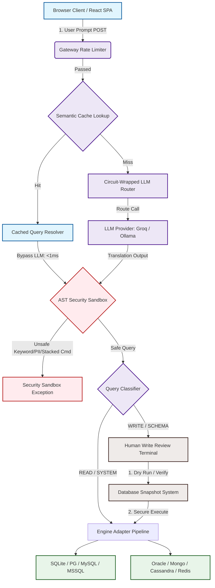

# NexusQuery Engine

<!-- Primary Badges -->
[](file:///e:/database/DATABASE-MANAGER/README.md)
[](file:///e:/database/DATABASE-MANAGER/core/adapters/)
[](file:///e:/database/DATABASE-MANAGER/core/circuit_breaker.py)
[](file:///e:/database/DATABASE-MANAGER/core/validator.py)

> Internal Codename: **Meridian Data** — A High-Performance, Secure, AI-Assisted Query Translation and Database Management Platform.

---

## Executive Summary & Architecture

**NexusQuery Engine** is an enterprise-grade database management client and translation engine that empowers analysts and developers to query and operate on complex databases using plain English. 

The system leverages advanced Large Language Models (LLMs) to dynamically translate natural language prompts into target-dialect queries—spanning **SQL, CQL, MongoDB Aggregation JSON, and Redis Protocols**—validates them against a strict zero-trust sandbox, and executes them with low-latency optimizations. 

### Why NexusQuery?
In production systems, granting LLMs raw database access is a critical security vulnerability. NexusQuery solves this by establishing a **Human-in-the-Loop Write Gate** coupled with a high-performance **Lexical AST Sandbox**. 

Every destructive database operation (writes/modifications) is intercepted, dry-run for row impact estimation, backed up via automated transactional snapshots, and queued for manual human execution. Ready-only operations are cached using a sub-1ms mathematical vector semantic cache to bypass LLM token costs entirely for duplicate or similar prompts.

---
## Nexus-query High-Level Description
NexusQuery is a production-grade database orchestration gateway developed to bridge the gap between natural language interface models and physical data layers. Operating at the boundary of transactional databases, NexusQuery securely translates English prompts into dialect-perfect query payloads (covering PostgreSQL, MySQL, Cassandra CQL, MongoDB, Redis, and more) while protecting underlying infrastructures.

Engineered with a zero-trust model, the gateway features a thread-safe distributed rate limiter, a stateful circuit breaker to shield remote inference APIs, and a lexical AST validator to eliminate command injection and PII leakage. Read-only queries bypass LLM token costs entirely via a sub-1ms cosine similarity semantic cache, while structural writes are gated through automated database snapshots and an interactive human-in-the-loop review queue.


## High-Performance System Architecture

The following diagram illustrates the lifecycle of a request, demonstrating the zero-trust security perimeter, LLM resiliency layers, semantic cache path, and adapter topography.



---

## Core Engineering Pillars (Under the Hood)

To support production-level workloads similar to systems run at Uber and Amazon, NexusQuery implements five primary system-level resiliency and performance frameworks:

### 1. Mathematical Semantic Query Cache (`core/semantic_cache.py`)
To prevent repetitive, expensive LLM calls, the engine uses a high-performance **Bag-of-Words and Character 3-Gram Term-Frequency (TF) Vectorizer** combined with a mathematical **Cosine Similarity** engine.

#### Vector space term translation:
1. **Tokenization & Stopword Elimination**: User prompts are lowercased and stripped of punctuation. Words are cross-referenced with a low-overhead, static stopword registry (`STOP_WORDS`) to isolate pure semantic keys.
2. **Typos & Variant Indexing**: The query is broken down into character-level 3-grams (`get_char_ngrams`).
3. **Weight Formulation**: Terms and n-grams are compiled into a sparse term-frequency vector mapping:
   $$\mathbf{V}(t) = (\text{Word Token} \times 1.5) + (\text{Char 3-Gram} \times 0.3)$$
4. **Cosine Similarity Evaluation**: When a new prompt $\mathbf{A}$ enters, it is computed against all active database-dialect vectors $\mathbf{B}$ inside `db/semantic_cache.json` using the cosine similarity metric:
   $$\cos\theta = \frac{\mathbf{A} \cdot \mathbf{B}}{\|\mathbf{A}\| \|\mathbf{B}\|} = \frac{\sum_{i=1}^{n} A_i B_i}{\sqrt{\sum_{i=1}^{n} A_i^2} \sqrt{\sum_{i=1}^{n} B_i^2}}$$

If the similarity score hits or exceeds a strict threshold of **$\ge 0.82$**, the translation is instantly resolved in **microseconds (<1ms)**, bypassing the LLM entirely.

---

### 2. Concurrency-Safe Distributed Rate Limiting (`core/rate_limiter.py`)
Protects backend API boundaries (FastAPI routes and React endpoints) from query starvation and denial-of-service (DoS) attacks.
*   **Mechanism**: Implements a thread-safe, memory-efficient **Token Bucket** algorithm using native thread locks (`threading.Lock`).
*   **Policy**: Each connection client has a dedicated bucket configured with a maximum capacity and a replenishment rate (tokens/sec). Threads requesting queries must acquire a token. If the bucket is empty, the rate limiter intercepts the request, fast-failing with a `429 Too Many Requests` response.

---

### 3. Stateful Resilience Circuit Breaker (`core/circuit_breaker.py`)
LLM APIs (such as Groq Cloud or local Ollama instances) are subject to network dropouts and capacity failures. NexusQuery wraps all downstream model invocations inside a stateful **Circuit Breaker State Machine** to prevent cascading backend freezes.

```
                  +-----------------------------------+
                  |              CLOSED               |
                  |     (Normal Flow; Calls LLM)      |
                  +-----------------+-----------------+
                                    |
                       Failure Count >= Threshold
                                    |
                                    v
   +--------------------------------+-----------------+
   |                              OPEN                |
   |              (Fast-Fails Calls Downstream)       |
   +------------------------+-------------------------+
                            |
                   Recovery Timeout Expired
                            |
                            v
   +------------------------+-------------------------+
   |                            HALF-OPEN             |
   |             (Trial Execution; Direct Check)      |
   +-----------------+----------------------+---------+
                     |                      |
                  Success                 Failure
                     |                      |
                     v                      v
                (To CLOSED)             (To OPEN)
```

*   **Closed State**: Operations flow normally. Consecutive connection failures are tracked.
*   **Open State**: If failure counts exceed `failure_threshold = 5`, the circuit trips to **OPEN**. Subsequent API queries are fast-failed instantly with a `CircuitBreakerOpenException` without reaching the network card, shielding connection pools from resource exhaustion.
*   **Half-Open State**: After a `recovery_timeout = 30s` expiration, a single probe query is allowed. If it succeeds, the circuit heals back to **CLOSED** and resets counters. If it fails, the circuit re-trips to **OPEN** immediately.

---

### 4. Zero-Trust Lexical AST Security Sandbox (`core/validator.py`)
The system treats LLM query outputs as unverified user input. All translations must pass through the `validator.py` security checkpoint.

1. **AST Tokenizer & Comment Stripper**:
   Using a regex-based parser, the validator strips all comment-based SQL bypass techniques (e.g. `/* ... */`, `--` injection styles) and splits the query into clean lexical tokens:
   ```python
   sql = re.sub(r'/\*.*?\*/', ' ', sql, flags=re.DOTALL)
   sql = re.sub(r'--.*', '', sql)
   ```
2. **Administrative & Destructive Filter**: Syntactically checks and blocks administrative schema-altering operations (`DROP`, `TRUNCATE`, `ALTER`, `GRANT`, `REVOKE`, `SHUTDOWN`, `ATTACH`, `DETACH`) at the token level.
3. **Data Loss & Stacking Gate**: Rejects any statement containing a semicolon `;` to completely block command-stacking (e.g. appending a destructive write statement to a safe select statement).
4. **Column Metadata Blacklist**: Compares tokens against a strict sensitive column registry (`SENSITIVE_COLUMNS`), blocking queries that attempt to read `ssn`, `password`, `credit_card`, `secret`, `salt`, `hash`, or `token`.

---

### 5. Self-Healing Snapshots & Storage Quota (`core/snapshot.py`)
To prevent physical backup volumes from consuming server disk space during intensive transactional modifications:
*   **Pre-Write Snapshots**: When a `WRITE` statement is authorized, the engine takes a physical copy of the database (SQLite) or invokes native utility dumps (PG, MySQL, MSSQL) before execution.
*   **Storage Quota Management**: Enforces a strict global directory budget of **20 MB** across all active snapshots.
*   **Self-Healing Garbage Collector**: On startup or file registry operations, the engine scans the directory, prunes orphaned snapshot files lacking database connection mappings, and deletes the oldest snapshots first when the folder exceeds the quota constraint.

---

## Dialect-Agnostic Adapter Topography

NexusQuery implements an abstract database interface (`core/adapters/base.py`). This abstraction enables the REST backend to execute, introspect, and snapshot schemas uniformly across SQL and NoSQL engines:

| Engine | Dialect Family | Schema Extraction Mechanism | Snapshot Strategy |
| :--- | :--- | :--- | :--- |
| **SQLite** | SQL | Introspects `sqlite_master` metadata tables | Logical copy of the physical database file |
| **PostgreSQL** | SQL | Queries `information_schema.columns` and catalogs | Executes `pg_dump` CLI subprocess |
| **MySQL** | SQL | Queries `information_schema` with key-constraints | Executes `mysqldump` subprocess |
| **MS SQL Server**| SQL | Uses `sys.tables` and sys column catalog queries | Native T-SQL backup task execution |
| **Oracle** | SQL | Queries `all_tab_columns` and indexes | Logical table export (`expdp`) command |
| **MongoDB** | NoSQL (JSON) | Scans collection keys via schema sampling | BSON binary snapshot using `mongodump` |
| **Cassandra** | CQL | Queries system schemas `keyspace_properties` | Executes system keyspace snapshots |
| **Redis** | Redis Keys | Runs incremental keyspace `SCAN` commands | Forces `BGSAVE` dump snapshots |

---

## Enterprise Roadmap: Scalability for Tech Giants

To demonstrate how the NexusQuery Engine scales to meet the requirements of top-tier technology platforms, the following roadmap details high-impact, modular integrations:

### 🏪 Walmart Scale (Retail, Supply Chain, and Massive Warehousing)
*   **Distributed Query Routing (Trino Adapter)**: Point the query engine to a distributed SQL engine like **Trino** or **Presto**, allowing users to write natural language queries over petabytes of SKU transactions stored in HDFS, Snowflake, or Amazon S3 lakes.
*   **Runaway Cost Guardrail**: Analyze the AST structure of generated queries. Check table metadata sizes; if a query targets a table with $> 100$ million rows without including a partition key or index in the `WHERE` clause, reject it automatically.

### 🚗 Uber / Uber Freight Scale (Logistics, Spatial Indices, & Telemetry)
*   **H3 Spatial Grid Index Enforcement**: Embed Uber's open-source **H3 spatial index** logic into the LLM context. Prompts querying geographic coordinates (ETAs, supply concentrations) will be optimized to use hexagonal grid cell lookups (`h3_to_parent`, `h3_k_ring`) instead of heavy spatial SQL scans.
*   **High-Throughput Streaming Adapter**: Build a specialized ClickHouse/TimescaleDB time-series adapter, enabling real-time analytical window queries over active driver positions and trip state streams.

### 📦 Amazon Scale (AWS Ecosystem, Graph Recommendations, & Security Isolation)
*   **AWS IAM Role-Based Database Tunneling**: Replace physical saved credentials with dynamic AWS IAM integration. When a user requests database access, assume an IAM role mapping directly to their session context, utilizing AWS RDS IAM Authentication.
*   **Amazon Neptune Graph DB Adapter**: Develop a Gremlin/SPARQL translator to handle natural language graph queries for product-recommendation engines and customer relationship networks.

### 🔍 Google Scale (BigQuery Cost Budgets & Structured Inference)
*   **BigQuery Byte-Scanned Pricing Guard**: Before sending a generated query to Google BigQuery, perform a dry run via the BigQuery API to evaluate total bytes scanned. If the estimated query cost exceeds a configured quota, halt the query.
*   **Vertex AI & Gemini Function Calling**: Replace unstructured text-to-SQL parsing with Gemini structured JSON outputs, providing higher code translation accuracy and lower schema-parsing errors.
*   **Scalable Memory (Vertex Vector Search)**: Replace the local file-based semantic cache with a scalable vector database (e.g., pgvector or Milvus) to manage millions of enterprise-wide queries.

### 🏢 Microsoft Scale (Enterprise Identity & Azure Cloud Analytics)
*   **Entra ID (Azure AD) Group Mapping**: Connect Microsoft Entra ID SSO directly to our auth routers, mapping corporate active-directory groups to the roles `VIEWER`, `EDITOR`, and `ADMIN`.
*   **Azure Synapse & Cosmos DB Support**: Add native Cosmos DB querying with RU (Request Unit) cost budgeting controls to protect Azure databases from query spikes.

### 🏡 Airbnb Scale (Marketplace Catalogs & Trust-and-Safety Governance)
*   **PII Masking Middleware**: Add a real-time data masking filter to the returned row payload. If sensitive guest data (e.g. email, passport details, phone number) is returned, mask the values with synthetic hashes before the data reaches the frontend.
*   **Governed Semantics Store (dbt/Cube.js)**: Teach the LLM to write queries against a governed metrics semantic layer (dbt or Cube.js) instead of raw database tables. This shields the engine from database schema updates.

---

## Technical Stack Reference

| Component | Technology | Enterprise Role |
| :--- | :--- | :--- |
| **Backend** | Python 3.11, FastAPI | High-performance asynchronous REST API routing |
| **Frontend** | React 19, Vite 8, Tailwind CSS v4 | Fully-featured single page application (SPA) |
| **Charts** | Chart.js 4 + react-chartjs-2 | On-the-fly rendering of AI-suggested analytical charts |
| **Encryption** | Cryptography (Fernet) | Encrypts saved connection passwords in database configurations |
| **Reporting** | python-pptx | Dynamic creation of PowerPoint reports from dataset results |
| **Fallback LLM** | Ollama API (Mistral) | Guarantees system continuity when cloud APIs are offline |

---

## Installation & Local Bootstrapping

### Step 1: Clone the Repository
```bash
git clone https://github.com/iamritik25/nexus_query.git

```

### Step 2: Establish Backend Sandbox Environment
```bash
# Create the python virtual environment
python -m venv venv

# Activate on Linux/MacOS
source venv/bin/activate
# Activate on Windows PowerShell
.\venv\Scripts\Activate.ps1
```

### Step 3: Install Dependencies & Setup Configurations
```bash
# Install required libraries
pip install -r requirements.txt

# Create application-local environment file
cp .env.example .env
cp db/llm_config.json.example db/llm_config.json
```
> [!IMPORTANT]
> Edit the newly created `.env` file and insert your `GROQ_API_KEY` for cloud-based query translation. If omitted, the engine will automatically fall back to local Ollama execution.

### Step 4: Launch Dev Servers
To run the server-rendered Jinja UI and FastAPI application:
```bash
python main.py
```
This runs the application on **`http://localhost:5000`**.

To launch the modern **React 19 + Vite 8 SPA** developer environment:
```bash
cd meridian-frontend
npm install
npm run dev
```
This serves the frontend at **`http://localhost:5173`** with automated CORS proxying directed to the backend.

---

## Standard Demonstration Credentials

For local developer exploration, the system includes three predefined role-based profiles:

| Account Name | Password | System Privilege | Action Permissions |
| :--- | :--- | :--- | :--- |
| **viewer1** | `viewer123` | **VIEWER** | Runs `READ` (SELECT) and `SYSTEM` (introspection) actions only. |
| **editor1** | `editor123` | **EDITOR** | Performs `READ` and `WRITE` queries (pending review gate and rollback snapshot). |
| **admin1** | `admin123` | **ADMIN** | Complete control. Performs all queries, writes, and database schema updates (`SCHEMA`). |

---

## Licensing & Governance

All rights reserved by the author. To use, redistribute, or build on this code, please reach out to the project maintainers. In accordance with standard open-source best practices for production projects, developers are encouraged to include an MIT or Apache 2.0 license file at the repository root.
